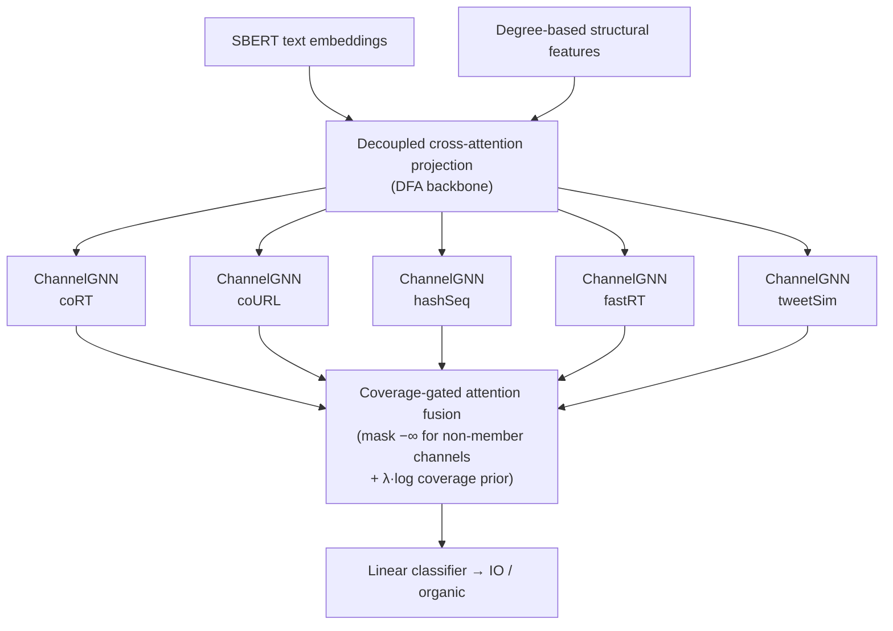

# CS-DFA — Zero-Shot Cross-Country Detection of Information Operations

Final project for the Social Media Mining course (CE7066) at National Central
University. We extend **IOHunter** (AAAI 2025), a graph foundation model for
detecting state-sponsored information operations (IO) on Twitter/X, and show
that its zero-shot cross-country transfer failure is caused by **coverage
heterogeneity** — not distribution shift. Our fix, **CS-DFA**
(Channel-Specific Decoupled Feature Alignment) with **coverage-gated fusion**,
raises average zero-shot test F1-macro across six countries from **0.775 to
0.952**, improving on every country.

📄 **Paper:** [`paper/`](paper/) (IEEEtran conference format) · 📓 **Colab
walkthrough:** [SMM_Colab](https://colab.research.google.com/drive/1MyJvyczQWwc6FRyL0XowibPzym9J1CIn) ·
📚 **Method write-up:** [`docs/CS-DFA.md`](docs/CS-DFA.md)

## Problem

Detectors of coordinated influence campaigns must generalize to countries
never seen during training: when a new campaign emerges there are no labels
for it. In this **zero-shot cross-country** protocol the model trains on five
source countries and is evaluated on the held-out target country. IOHunter
fuses text embeddings with a graph that **merges** five behavioral similarity
networks (co-retweet, co-URL, hashtag sequence, fast retweet, tweet
similarity) — and its performance collapses on some targets (F1-macro 0.58 on
China).

Our failure analysis found the reason: the five sub-networks cover wildly
different fractions of accounts per country (for China, three of the five
channels cover only 3–7% of accounts). An account absent from a channel is an
isolated node in that channel's graph; merging everything into one graph
floods message passing with this noise and dilutes the coordination signal
that actually transfers.

## Approach

CS-DFA keeps the five behavioral channels separate — one GNN per sub-network —
and fuses the per-channel embeddings with **coverage-gated attention**: a
binary participation mask sets the attention score of every channel an account
does not belong to to −∞, so each account aggregates only over channels it
genuinely participates in.



## Results

Zero-shot cross-country test F1-macro (mean ± std over five random splits,
single NVIDIA T4):

| Method | China | Iran | UAE | Cuba | Russia | Venezuela | Avg. |
|---|:-:|:-:|:-:|:-:|:-:|:-:|:-:|
| IOHunter (paper-reported) | 0.581 | 0.728 | 0.839 | **0.899** | 0.798 | 0.910 | 0.793 |
| CORAL | 0.585 | 0.705 | 0.878 | 0.848 | 0.823 | 0.768 | 0.768 |
| DANN | 0.578 | 0.705 | 0.857 | 0.794 | 0.823 | 0.792 | 0.758 |
| DFA (merged graph) | 0.603 | 0.706 | 0.880 | 0.856 | 0.836 | 0.768 | 0.775 |
| **CS-DFA (ours)** | **0.837** | **0.998** | **0.993** | 0.888 | **1.000** | **0.998** | **0.952** |

**The gate is the contribution.** Ablations isolate the mechanism: removing
channel-level CORAL or the coverage prior changes the average by ≤ 0.002, but
removing the coverage gate collapses it to **0.686** — *below* the single-graph
DFA baseline. Splitting behavior into channels is not enough on its own, and
explicit distribution alignment is unnecessary once low-coverage noise is
gated out.

| Variant | Gating | Prior λ | CORAL | Avg. F1 |
|---|:-:|:-:|:-:|:-:|
| CS-DFA (full) | on | 1.0 | channel | **0.952** |
| − CORAL | on | 1.0 | off | 0.950 |
| − prior | on | 0.0 | channel | 0.952 |
| − gating (bare backbone) | off | 0.0 | off | 0.686 |
| DFA (merged graph) | — | — | — | 0.775 |

### Source-data efficiency

| Method | 10% | 50% | 100% |
|---|:-:|:-:|:-:|
| DFA | 0.758 | 0.769 | 0.775 |
| **CS-DFA** | **0.958** | **0.955** | **0.952** |

CS-DFA keeps its full-data performance — and its full margin over DFA — with
only 10% of the labeled source accounts.

`--source_frac` subsamples only the labeled source-country training accounts
(class-stratified, fixed seed); target data and evaluation splits are
untouched. See [`docs/CS-DFA.md`](docs/CS-DFA.md) for details.

## How to reproduce

**Colab (recommended):** open
[SMM_Colab](https://colab.research.google.com/drive/1MyJvyczQWwc6FRyL0XowibPzym9J1CIn),
which clones this repo, symlinks the dataset from Google Drive, and runs every
experiment on a T4 GPU. The same notebook lives in this repo as
[`colab_run.ipynb`](colab_run.ipynb).

**Locally:**

```bash
# Dataset: download from the Zenodo link in the IOHunter repo
# (https://github.com/mminici/InfoOpsGFM) and place it under
# <project_root>/data/processed/<country>/

cd src

# main method, all six countries
python run_experiments.py --method csdfa --device 0

# ablations
python run_experiments.py --method csdfa_nocoral --device 0   # CORAL off
python run_experiments.py --method csdfa_noprior --device 0   # coverage prior off
python run_experiments.py --method csdfa_nogate  --device 0   # gating off (backbone control)

# data-efficiency (10% / 50% of labeled source accounts)
python run_experiments.py --method csdfa --source_frac 0.1 --device 0
python run_experiments.py --method csdfa --source_frac 0.5 --device 0
python run_experiments.py --method dfa   --source_frac 0.1 --device 0
python run_experiments.py --method dfa   --source_frac 0.5 --device 0
```

Dependencies: PyTorch (CUDA), PyTorch Geometric, mlflow, scikit-learn, pandas,
networkx (Colab pre-installs everything except `torch_geometric` and
`mlflow`).

## Repository layout

```
paper/           Conference paper (IEEEtran LaTeX; compiles with tectonic/pdfLaTeX)
docs/            Method write-up (CS-DFA.md: motivation, method, results, ablations)
src/             Training scripts + unified runner (run_experiments.py)
results/         Experiment logs (zero-shot_*.txt), parsers, and plots
colab_run.ipynb  Colab GPU runner / technical walkthrough
poster_overleaf/ Course-poster LaTeX source (predecessor of the paper)
```

## Acknowledgments

Built on the IOHunter code and dataset released with:

> Minici, Luceri, Fabbri, Ferrara. *IOHunter: Graph Foundation Model to
> Uncover Online Information Operations.* AAAI 2025.
> https://github.com/mminici/InfoOpsGFM

Baselines reproduced under our unified pipeline: CORAL, DANN, and our DFA
(decoupled cross-attention alignment).
